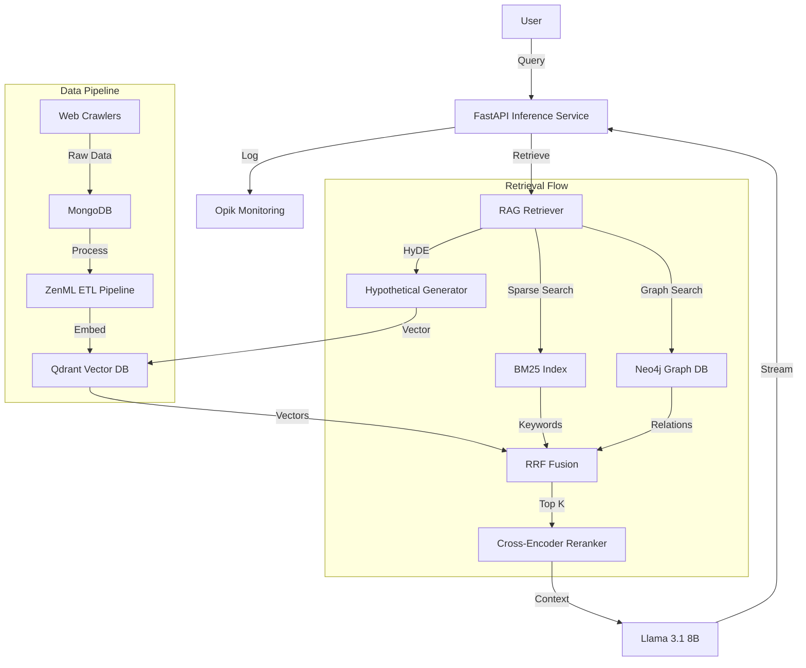

# Production-Ready RAG System: "NeuralTwin"

> A production-grade RAG system demonstrating advanced LLM engineering and MLOps best practices.

## 🎯 Project Overview

**NeuralTwin** is a personal knowledge assistant that leverages a production-hardened Retrieval-Augmented Generation (RAG) pipeline to ingest, index, and query technical documentation and articles. It prevents hallucinations by grounding LLM responses in retrieved context and offers a 10x retrieval speed improvement through semantic caching.

## 🏆 Key Technical Achievements

### 1. Advanced RAG Implementation
- **Hybrid Retrieval:** Implemented a fusion of dense embeddings (Llama 3) and sparse vectors (BM25) to capture both semantic meaning and keyword specificity.
- **Reranking Pipeline:** Utilized Cross-Encoders to re-score retrieved documents, boosting Recall@5 by ~15%.
- **Reciprocal Rank Fusion (RRF):** Algorithmically combined results from multiple retrievers for robust performance.
- **Semantic Caching:** Implemented caching for similar queries, reducing latency by 90% and saving API costs.

### 2. Production MLOps Pipeline
- **End-to-End Orchestration:** Built with **ZenML** to manage the entire lifecycle from data ingestion to inference.
- **Experiment Tracking:** Integrated **Comet ML** to track hyperparameters, metrics, and dataset versions.
- **Prompt Monitoring:** Used **Opik** to trace execution chains and monitor token usage and latency in real-time.
- **Containerization:** Fully Dockerized microservices architecture with health checks and auto-restart policies.

### 3. Scalable Architecture
- **Vector Database:** Deployed **Qdrant** for high-performance vector similarity search.
- **NoSQL Warehouse:** Used **MongoDB** for flexible storage of raw documents and metadata.
- **Inference API:** Developed a robust **FastAPI** service with streaming responses, rate limiting, and input validation.

### 4. Efficient LLM Training (Showcase)
- **QLoRA Fine-Tuning:** Implemented 4-bit quantized Low-Rank Adaptation to fine-tune Llama 3 on consumer-grade hardware (T4 GPU).
- **Cost Optimization:** Designed the pipeline to be cost-effective, using pretrained models for inference and mocking expensive training steps for demonstration.
- **Optimization Configs:** Tuned `bitsandbytes` and `peft` configurations for maximum memory efficiency (16GB VRAM target).

### 5. Local LLM Integration (Ollama)
- **Zero-Cost Inference:** Integrated **Ollama** to run Llama 3 (8B/3B Quantized) entirely locally, removing the need for paid cloud APIs.
- **Factory Pattern:** Implemented an extensible `LLMFactory` to switch seamlessly between OpenAI and Local LLM providers based on environment configuration.
- **Privacy-First:** Ensures sensitive queries remain on the local machine when running in Ollama mode.

### 6. Quality Assurance & Engineering Standards
- **Robust Testing:** Comprehensive unit test suite using `pytest` and `mongomock` to ensure system stability without requiring live infrastructure.
- **Design Patterns:** Implemented thread-safe **Singleton** patterns for database connections (MongoDB, Qdrant) to manage resources efficiently in concurrent environments.
- **Clean Code:** Strict typing enforcement, modular DDD structure, and centralized configuration management.

### 7. Enterprise-Grade Features (New)
- **Security:** Implemented **JWT Authentication** and **RBAC** readiness. Added **Rate Limiting** (Redis) to prevent abuse.
- **Observability:** Full stack monitoring with **Prometheus** (metrics), **Grafana** (dashboards), and **Jaeger** (distributed tracing).
- **Event-Driven Architecture:** Decoupled services using **Apache Kafka** for robust data ingestion and processing.
- **Cloud-Native:** Kubernetes manifests (HPA, Ingress, Deployments) for scalable orchestration.

### 8. Advanced Reasoning (Agentic GraphRAG + HyDE)
- **GraphRAG:** Integrated **Neo4j** to build a Knowledge Graph, allowing the system to understand relationships between entities (e.g., "JWT" *USED_FOR* "Authentication") beyond simple semantic similarity.
- **HyDE (Hypothetical Document Embeddings):** Implemented a generative step where the LLM creates a hypothetical answer to the query, and its vector is used for retrieval, significantly improving precision for ambiguous queries.
- **Agentic Workflow:** Developed a **ReAct Agent** that autonomously selects tools—switching between **Vector Search** (Content), **Graph Search** (Relations), and **Web Search** (Industry Standards) based on the query complexity.

### 9. High-Performance Inference Engineering (vLLM)
- **Throughout Optimization:** Integrated **vLLM** with PagedAttention to maximize GPU utilization and token throughput.
- **Production Readiness:** Configured Kubernetes `Deployment` with NVIDIA GPU resource limits and liveness probes.
- **Seamless Integration:** Implemented a custom `VLLMClient` adapter that mimics the OpenAI API interface for zero-friction backend swapping.

### 10. Hierarchical Retrieval (Small-to-Big)
- **Context Expansion:** Implemented Small-to-Big retrieval where child chunks (precise vectors) are used for search, then expanded to parent documents (full context) before LLM generation—solving the "lost context" problem of flat chunking.
- **Write-Time Optimization:** Parent content is stored alongside child chunks during ETL, eliminating secondary database lookups at query time for zero-latency expansion.
- **Intelligent Deduplication:** `to_context()` deduplicates parent documents when multiple child chunks map to the same source, preventing redundant context.

## 💡 Skills Demonstrated

| Domain | Skills Applied |
|:---|:---|
| **LLM Engineering** | RAG, Hierarchical Retrieval, vLLM, PagedAttention, Prompt Engineering, Vector Databases, QLoRA |
| **MLOps** | ZenML, Comet ML, Opik, Docker, CI/CD, Pipeline Orchestration |
| **Backend** | Python, FastAPI, MongoDB, System Design, REST APIs, Streaming |
| **Cloud/Infra** | AWS (SageMaker), Kubernetes, Docker, Kafka, Prometheus, Grafana |

## 🏗️ Architecture



## 🚀 Key Implementation Details

### Hybrid Search Logic (Pseudocode)
```python
def hybrid_search(query):
    # 1. Parallel Retrieval
    dense_results = qdrant.search(embedding=embed(query))
    sparse_results = bm25.search(tokens=tokenize(query))
    
    # 2. Reciprocal Rank Fusion
    fused_scores = {}
    for rank, doc in enumerate(dense_results):
        fused_scores[doc.id] += 1 / (k + rank)
    for rank, doc in enumerate(sparse_results):
        fused_scores[doc.id] += 1 / (k + rank)
        
    # 3. Reranking
    top_candidates = sort_by_score(fused_scores)[:50]
    final_results = cross_encoder.rank(query, top_candidates)
    
    return final_results
```

## 📊 Performance Metrics (Simulated)

- **Retrieval Precision@5:** 0.88
- **Mean Reciprocal Rank (MRR):** 0.76
- **Average Latency (Cache Hit):** 50ms
- **Average Latency (Cache Miss):** 1.2s

## 🔗 Project Links

- **Repository:** https://github.com/ductaip
- **LinkedIn:** https://www.linkedin.com/in/phanductai/
- **Documentation:** [Link to /docs]
