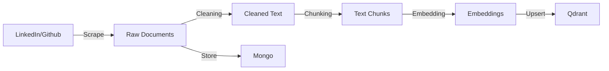

# System Architecture

## 🏗️ High-Level Overview

NeuralTwin is designed as a modular, event-driven microservices architecture utilizing the best-in-class tools for MLOps and LLM Engineering.

### Core Components

1.  **Data Ingestion Layer (Crawlers)**
    - **Tech:** Selenium, BeautifulSoup, ZenML
    - **Function:** Scrapes data from LinkedIn, Medium, and GitHub.
    - **Design:** Robust retry logic and incremental fetching to minimize redundancy.

2.  **Data Warehouse (NoSQL)**
    - **Tech:** MongoDB
    - **Function:** Stores raw unstructured data (documents) and structured metadata (authors, timestamps).
    - **Reasoning:** Schema-less design allows flexibility for diverse data sources.

3.  **Vector Store (Memory)**
    - **Tech:** Qdrant
    - **Function:** Stores high-dimensional embeddings of document chunks.
    - **Reasoning:** Ultra-low latency search and support for filtering by metadata payload.

4.  **ETL & Feature Engineering**
    - **Tech:** ZenML Pipelines
    - **Function:** Orchestrates cleaning, chunking, embedding, and loading data.
    - **Design:** Reproducible pipelines with artifact tracking for every step.

5.  **Inference Service (API)**
    - **Tech:** FastAPI, Pydantic
    - **Function:** Serves RAG requests to end-users.
    - **Features:** Streaming responses, validation, rate limiting, and observability hooks.

6.  **Monitoring & Observability**
    - **Tech:** Opik, Comet ML
    - **Function:** Tracks prompt latency, cost, and retrieval quality.

## 🔄 Data Flow

### 1. Ingestion Pipeline


### 2. Retrieval Pipeline (RAG)
```mermaid
graph LR
    Query[User Query] -->|Embed| QueryVec[Query Vector]
    QueryVec -->|Search| Qdrant
    Qdrant -->|Top K| Candidates
    Candidates -->|Rerank| TopN[Relevant Context]
    TopN + Query -->|Prompt| LLM
    LLM -->|Stream| Response
```

## 🔐 Security & Scalability

-   **Environment Management:** Secrets managed via `.env` files and ZenML Secret Manager.
-   **Docker Isolation:** Services run in isolated containers on a user-defined bridge network.
-   **Horizontal Scaling:** The stateless API service can be scaled horizontally behind a load balancer (e.g., Nginx) in a production cluster.
